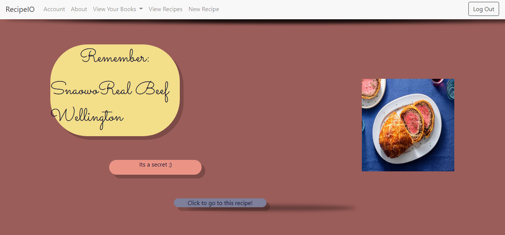

# RecipeIO
  
  

## TABLE OF CONTENTS:

* [Description](#description)

* [Installation guide](#installation) 

* [Usage Info](#usage) 

* [Contribution Guidelines](#contribution) 

* [Testing Instructions](#testing) 

* [Questions](#questions)

* [Credits](#credit)

* [License](#license)

## DESCRIPTION:

This is the ReadMe for House of Stark's project titled: RecipeIO

This is a group project showcasing our knowledge of full-stack development

## INSTALLATION:

Visit it on Heroku to try it out! <a target="_blank" rel="noopener noreferrer" href="https://recipeio-project2.herokuapp.com/login">Check it out here!</a>

## USAGE:

Upon visiting our website, unless logged in already, you will be taken to the log in page. Here you can log in or create a new account. Once logged in, you'll be taken to the homepage. This page features a random recipe from our community of chefs to check out. From the nav bar at the top, one can see their account, read more about the site and our team, view their recipe books or make new ones, view all their recipes, and make new recipes. 

To make a new recipe, choose it's name, its ingredients, its instructions, and input a URL to a picture of the dish. One must assign it at least one book from the checkboxes! If there are no checkboxes, click on 'new books' and make a new one before making a new recipe.

## CONTRIBUTION:

Sorry, this project is privately maintained.

## TESTING:

Thank you, but no testing is needed at this time.

## QUESTIONS:

If you have any questions,

you can contact me <a target="_blank" rel="noopener noreferrer" href="https://github.com/Lawhornmatt">at my GitHub</a> or email me here: fake@notreal.com

## CREDIT:

This project was made in 2022 by Group Two

This project was made through the contributions of:

<a target="_blank" rel="noopener noreferrer" href="https://github.com/alexyn26">Alexandra Najera</a>

<a target="_blank" rel="noopener noreferrer" href="https://github.com/Chueg">Andrew Johnson</a>

<a target="_blank" rel="noopener noreferrer" href="https://github.com/josephpicardat">Joseph Picardat</a>

<a target="_blank" rel="noopener noreferrer" href="https://github.com/Lawhornmatt">Matthew Lawhorn</a>

<a target="_blank" rel="noopener noreferrer" href="https://github.com/RelentlessNC">Nicholas Conklin</a>

<a target="_blank" rel="noopener noreferrer" href="https://github.com/sky19930112">Samuel Hsu</a>

<a target="_blank" rel="noopener noreferrer" href="https://github.com/Thomasple13">Thomas Le</a>

## LICENSE:

This program is copyrighted under the MIT open source license.

Copyright 2022 Group Two

    Permission is hereby granted, free of charge, to any person obtaining a copy of this software and associated documentation files (the "Software"), to deal in the Software without restriction, including without limitation the rights to use, copy, modify, merge, publish, distribute, sublicense, and/or sell copies of the Software, and to permit persons to whom the Software is furnished to do so, subject to the following conditions:
    
    The above copyright notice and this permission notice shall be included in all copies or substantial portions of the Software.
    
    THE SOFTWARE IS PROVIDED "AS IS", WITHOUT WARRANTY OF ANY KIND, EXPRESS OR IMPLIED, INCLUDING BUT NOT LIMITED TO THE WARRANTIES OF MERCHANTABILITY, FITNESS FOR A PARTICULAR PURPOSE AND NONINFRINGEMENT. IN NO EVENT SHALL THE AUTHORS OR COPYRIGHT HOLDERS BE LIABLE FOR ANY CLAIM, DAMAGES OR OTHER LIABILITY, WHETHER IN AN ACTION OF CONTRACT, TORT OR OTHERWISE, ARISING FROM, OUT OF OR IN CONNECTION WITH THE SOFTWARE OR THE USE OR OTHER DEALINGS IN THE SOFTWARE.

[Further license information can be found here.](https://opensource.org/licenses/MIT)

